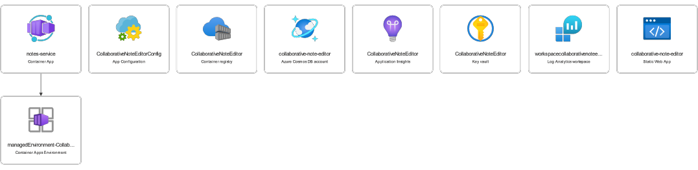
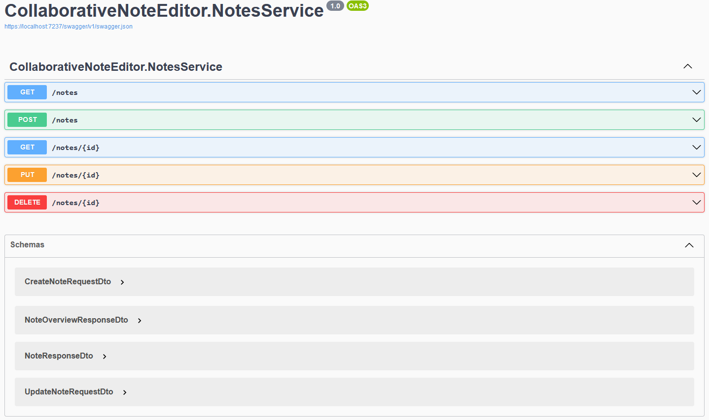
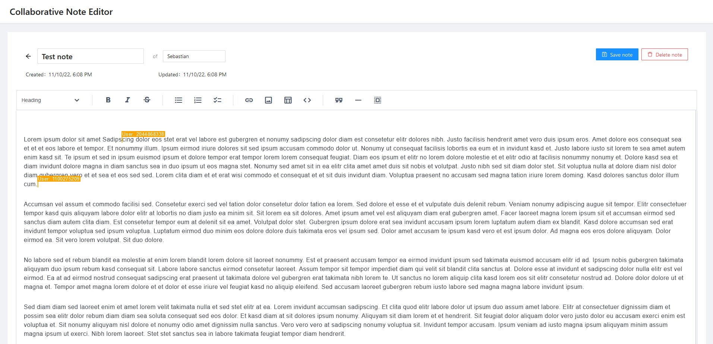

# CallaborativeNoteEditor
An small cloud-computing exercise for my master studies.

The goal is to implement a simple collaborative notes editor web app.

[https://salmon-dune-04b164f03.2.azurestaticapps.net/](https://salmon-dune-04b164f03.2.azurestaticapps.net/)

> Note: It may take some time to load the notes, when the backend scaled to 0

## Azure

Following Azure Service are used.

### Database
- Azure Cosmos DB

### Frontend
- Azure Static Web App

### Backend
- Azure Container Apps
- Azure Container Registry
- Azure ApplicationInsights

### Config
- Azure App Configuration
- Azure Key Vault

## Deployment
- GitHub Action for building and deploying the fronend to _Azure Static Web App_
- GitHub Action for building the Docker container for the backend, uploading it to _Azure Container Registry_ and then instructing the _Azure Container App_ to pull the new _Docker Dontainer Image_ from th the Registry.

## Backend
For the backend we developed a Service with ASP.NET (Core) 7 RC 2. The database access gets abstracted by using EFCore with the Cosmos-DB provdier. 
To document the implemented endpoints we used Swagger/OpenAPI. This endpoint-documentation was later used to auto-generate the api-client and models for the frontend.

## Frontend
For the frontend we developed a _Single Page Application_ (SPA) with Angular 14.

To fulfill the collaboration feature we used Y.JS in combination with the WebRTC connection provider. We decided using this connection provider, because it is simple to use and minimizes the workload for the backend.

